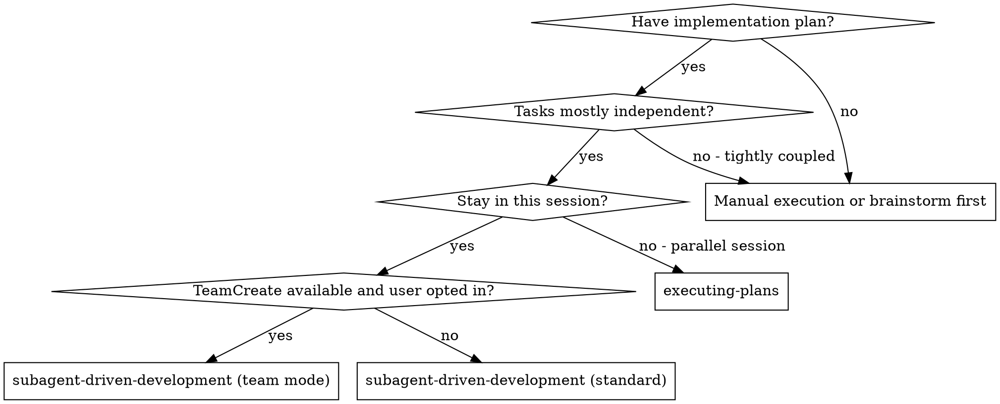
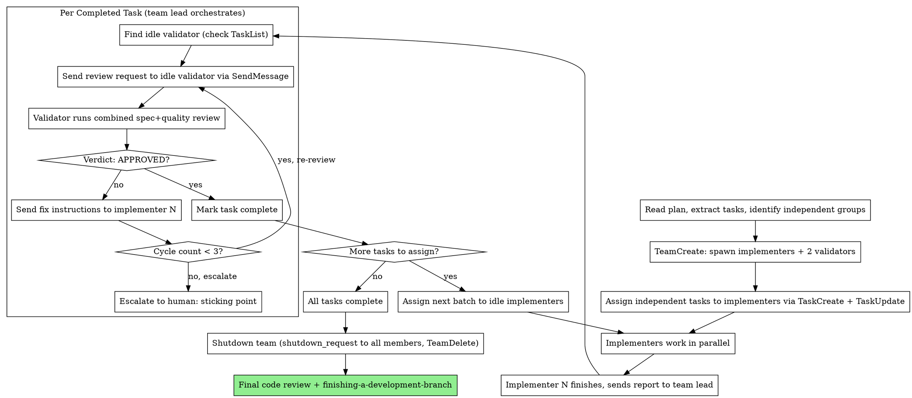

# Persistent Validator Pool Implementation Plan

> **For Claude:** REQUIRED SUB-SKILL: Use superpowers:executing-plans to implement this plan task-by-task.
> **SDK memory test result: RETAINED** (tested 2026-02-28) — persistent team members retain context between SendMessage calls. Phase 2 proceeds as designed.

**Goal:** Fix phantom completion and speed up validation in subagent-driven development by requiring auditable evidence citations (Phase 1) and adding a persistent validator pool team mode (Phase 2).

**Architecture:** Phase 1 hardens existing prompts — implementers must include test output and git diffs; spec reviewers must produce per-requirement `file:line` citations. Phase 2 adds a Team Mode with 2 persistent `validator` agents running combined spec+quality review in a single pass, eliminating per-review startup overhead and enabling cross-task gap detection.

**Tech Stack:** Markdown prompt templates, Claude Code teams API (`TeamCreate`, `SendMessage`, `TaskUpdate`)

**Design doc:** `docs/plans/2026-02-28-persistent-validator-pool-design.md`

---

## Pre-Flight

Before starting, create a feature branch:

```bash
cd ~/git/forks/superpowers
git checkout -b feature/persistent-validator-pool
```

All work happens on this branch. Commit frequently after each task.

---

## PHASE 1: Mandatory Evidence Citations
### (Prompt-only. Applies to both standard and team mode. Ships independently.)

---

### Task 1: Add mandatory evidence section to implementer-prompt.md

**Files:**
- Modify: `skills/subagent-driven-development/implementer-prompt.md`

**Step 1: Read the current file**

Open `skills/subagent-driven-development/implementer-prompt.md` and locate the `## Report Format` heading (currently the last section, around line 70 of the prompt template inside the backtick block).

**Step 2: Insert the mandatory evidence section**

Add the following block BETWEEN the closing line of `## Before Reporting Back: Self-Review` and `## Report Format`. The insertion point is after the line `If you find issues during self-review, fix them now before reporting.` and before `## Report Format`.

```
    ## Mandatory Evidence (Required Before Reporting)

    Before filling in the report below, gather this evidence and paste it verbatim:

    **1. Test output** — run your test suite and paste the full output (do not summarize):
    ```
    [paste full test command and output here]
    ```

    **2. Diff stat** — run `git diff --stat <base-sha>` (or `git diff --stat HEAD~1` if you made one commit) and paste output:
    ```
    [paste git diff --stat output here]
    ```

    **3. Files changed** — list each new or modified file with approximate count of substantive new lines

    **4. Behavior demonstration** (only if the task spec requires a specific demonstrable behavior):
    Run the exact command that exercises it and paste the output.

    A report submitted without this evidence section will be **rejected by the controller** and must be re-submitted with evidence included. Do not omit or summarize — paste the actual output.
```

The block must be inside the outer backtick code block (the prompt template), indented at the same level as the rest of the prompt content (4 spaces).

**Step 3: Verify the file looks right**

Re-read `implementer-prompt.md`. Confirm:
- The new `## Mandatory Evidence` section appears between `## Before Reporting Back: Self-Review` and `## Report Format`
- It is inside the outer ` ``` ` code block
- Indentation is consistent with surrounding content (4 spaces)
- The file still ends with the closing ` ``` ` at the bottom

**Step 4: Commit**

```bash
git add skills/subagent-driven-development/implementer-prompt.md
git commit -m "feat: require mandatory evidence in implementer report

Implementers must now include full test output, git diff --stat,
and file list before reporting complete. Reports without evidence
will be rejected by the controller."
```

---

### Task 2: Add file:line citation requirement to spec-reviewer-prompt.md

**Files:**
- Modify: `skills/subagent-driven-development/spec-reviewer-prompt.md`

**Step 1: Read the current file**

Open `skills/subagent-driven-development/spec-reviewer-prompt.md`. Note the structure inside the backtick template:
- `## CRITICAL: Do Not Trust the Report` section
- `## Your Job` section
- `Report:` section at the end (lines 58-60 of the prompt template)

**Step 2: Add citation requirement section**

Add the following block BETWEEN the end of `## Your Job` (after `**Verify by reading code, not by trusting report.**`) and the `Report:` line:

```
    ## Citation Requirement (Mandatory)

    For each requirement in the task spec, you MUST provide:
    - The specific `file:line` where it is implemented
    - A 2–3 line code excerpt or function signature as evidence

    Example format:
    - Requirement: "Function validates email format"
    - Citation: `src/validators.py:42` — `def validate_email(addr): return bool(EMAIL_RE.match(addr))`

    Mark any requirement with no citation found as **❌ MISSING**.

    **A ✅ approval without per-requirement citations is invalid.** The controller will reject
    prose-only verdicts. Do not write "I verified X is implemented" without citing the location.
```

**Step 3: Update the Report section**

Replace the current `Report:` lines:

Current (lines 58-60 inside template):
```
    Report:
    - ✅ Spec compliant (if everything matches after code inspection)
    - ❌ Issues found: [list specifically what's missing or extra, with file:line references]
```

Replace with:
```
    Report:
    - ✅ Spec compliant — include for EACH requirement: [requirement text → `file:line` → excerpt]
    - ❌ Issues found: [for each gap: requirement text, what was expected, what was found or missing, `file:line` if partially implemented]

    A ✅ without the per-requirement citation table is not accepted.
```

**Step 4: Verify the file**

Re-read `spec-reviewer-prompt.md`. Confirm:
- `## Citation Requirement` section appears before `Report:`
- The updated `Report:` section requires citations for ✅
- Everything is inside the outer ` ``` ` code block with consistent 4-space indentation

**Step 5: Commit**

```bash
git add skills/subagent-driven-development/spec-reviewer-prompt.md
git commit -m "feat: require file:line citations in spec reviewer verdicts

Spec reviewer must now produce per-requirement file:line citations
with code excerpts. Prose-only approvals are rejected. This makes
phantom completion immediately detectable from the evidence trail."
```

---

### Task 3: Verify Phase 1 changes are internally consistent

**Files:** None (read-only verification)

**Step 1: Read both modified files back**

Read `implementer-prompt.md` and `spec-reviewer-prompt.md` in full.

**Step 2: Verify the chain works**

The flow is:
1. Implementer includes test output + diff stat in report
2. Spec reviewer reads code (not report), produces `file:line` citations for each requirement
3. Controller can audit: do the citations exist? do they implement the requirement?

Check: does the spec reviewer prompt still say "Do Not Trust the Report"? (It should — the evidence from the implementer is additional signal, not a replacement for the reviewer reading code.)

Check: is there any contradiction between what the implementer is asked to produce and what the reviewer is asked to verify? There should not be — they operate independently.

**Step 3: Check git log**

```bash
git log --oneline -5
```

Expected: 2 commits on this branch above the starting point (one per task).

---

## PHASE 2: Persistent Validator Pool (Team Mode)
### Gate: Run SDK memory validation test first. If it fails, see fallback below.

---

### Task 4: Run SDK memory validation test

**This task cannot be scripted — it requires running in a Claude Code session with teams enabled.**

**Step 1: Open a Claude Code session and run this test**

In a fresh Claude Code session, run the following (requires `CLAUDE_CODE_EXPERIMENTAL_AGENT_TEAMS=1` in environment or global settings, or teams already enabled):

```
TeamCreate(team_name: "memory-test", description: "SDK memory retention test")

[Spawn agent]:
  Agent(subagent_type: "general-purpose", name: "test-agent", team_name: "memory-test",
        prompt: "You are in a memory retention test. Acknowledge this message by saying 'Ready'.")

[Wait for Ready response]

SendMessage(type: "message", recipient: "test-agent",
            content: "Remember the number 42. Acknowledge when you have it.",
            summary: "Memory test step 1")

[Wait for acknowledgment]

SendMessage(type: "message", recipient: "test-agent",
            content: "What number did I ask you to remember?",
            summary: "Memory test step 2")
```

**Step 2: Interpret result**

- Agent answers "42" → **SDK retains context**. Proceed with Phase 2 as designed.
- Agent fails to recall (says it doesn't know, or gives wrong answer) → **SDK does not retain context**. Use the Phase 2 Fallback (Task 4b) instead of Tasks 5-10.

**Step 3: Shut down test team**

```
SendMessage(type: "shutdown_request", recipient: "test-agent", content: "Test complete")
TeamDelete()
```

**Step 4: Document result**

Add a one-line note to the top of this plan file (under the header) indicating the test result:
`> SDK memory test result: RETAINED / NOT-RETAINED (tested YYYY-MM-DD)`

**If NOT-RETAINED: Jump to Task 4b. Skip Tasks 5-10.**

---

### Task 4b: (FALLBACK ONLY — skip if SDK retains context) Combined-review fresh subagent

> **⚠️ SKIPPED — SDK memory was retained (tested 2026-02-28).** The persistent validator topology in Tasks 5–10 was implemented instead. The `validator-prompt.md` created in this PR is for persistent team members (not fresh subagents); its content does not match the fallback description below. Task 4b is preserved here for reference only, in case SDK memory retention changes in a future Claude Code version.

**Only run this task if the SDK memory test in Task 4 failed.**

This fallback combines spec+quality into a single fresh subagent per task (parallel with the next implementation), rather than using a persistent validator pool.

**Files:**
- Create: `skills/subagent-driven-development/validator-prompt.md`
- Modify: `skills/subagent-driven-development/SKILL.md`

**Step 1: Create validator-prompt.md (combined, fresh subagent version)**

Create `skills/subagent-driven-development/validator-prompt.md`:

```markdown
# Validator Prompt Template (Combined Spec + Quality — Fresh Subagent)

Use this template when dispatching a validator subagent (replaces separate spec and quality reviews).

**Dispatch in parallel** with the next task's implementer subagent (don't wait sequentially).

**Purpose:** Verify the implementation matches spec AND is well-built, in a single pass.

```
Task tool (general-purpose):
  description: "Validate Task N: [task name]"
  prompt: |
    You are validating whether an implementation matches its specification and is well-built.

    ## What Was Requested

    [FULL TEXT of task requirements]

    ## What Implementer Reports (do not trust — verify independently)

    [From implementer's report, including their evidence: test output, diff stat, files changed]

    ## CRITICAL: Do Not Trust the Report

    Read the actual code. The report is a starting point only.

    ## Your Job — Two Sections

    ### Section 1: Spec Compliance

    For each requirement in the task spec, find the implementing code and produce:
    - `file:line` — the specific line where it is implemented
    - A 2–3 line excerpt or function signature as evidence
    - Mark as ❌ MISSING if no implementation found

    Also check for:
    - Extra/unneeded work not in spec
    - Misinterpretations of requirements

    ### Section 2: Code Quality

    On the same code (you've already read it for Section 1), assess:
    - Naming clarity (do names match what things do?)
    - Test quality (do tests verify behavior, not just mock it?)
    - YAGNI compliance (no overbuilding)
    - Pattern consistency with the existing codebase

    ## Report Format

    **Spec Compliance:**
    - [requirement] → `file:line` — [excerpt]  (repeat for each requirement)
    - ❌ MISSING: [requirement] — [what was expected, what was found]

    **Code Quality:**
    - Strengths: [list]
    - Issues (Critical/Important/Minor): [list with file:line]

    **Verdict:**
    - ✅ APPROVED — (only if all requirements have citations AND no Critical/Important quality issues)
    - ❌ NEEDS FIXES — [summarize what must be fixed before approval]
```
```

**Step 2: Update SKILL.md — replace two-stage dispatch with single validator dispatch**

In `SKILL.md`, replace the two dispatch lines in the Example Workflow from:
```
[Dispatch spec compliance reviewer]
...
[Get git SHAs, dispatch code quality reviewer]
```
to:
```
[Dispatch validator (combined spec+quality) — parallel with next implementer if one is starting]
```

Also update the process diagram and Prompt Templates section to reference `validator-prompt.md` instead of the two separate files.

**Step 3: Delete code-quality-reviewer-prompt.md**

```bash
grep -r "code-quality-reviewer-prompt" skills/ docs/ README.md 2>/dev/null
```

For any references found: update them to point to `validator-prompt.md`.

Then:
```bash
git rm skills/subagent-driven-development/code-quality-reviewer-prompt.md
```

**Step 4: Commit fallback changes**

```bash
git add -A
git commit -m "feat: merge spec+quality into single validator (fallback mode)

SDK memory test failed — persistent validator topology abandoned.
Combined spec+quality review into single fresh-subagent validator,
dispatched in parallel with next implementer. Eliminates sequential
spec→quality bottleneck without requiring context retention."
```

**→ Skip Tasks 5-10. Go directly to Task 11.**

---

### Task 5: Update SKILL.md — description, core principle, When to Use diagram

**Files:**
- Modify: `skills/subagent-driven-development/SKILL.md`

**Step 1: Update the opening description line (line 8)**

Replace:
```
Execute plan by dispatching fresh subagent per task, with two-stage review after each: spec compliance review first, then code quality review.
```

With:
```
Execute plan by dispatching fresh subagent per task, with combined spec+quality review after each. In team mode: persistent validator agents eliminate per-review startup overhead and enable cross-task gap detection.
```

**Step 2: Update core principle line (line 10)**

Replace:
```
**Core principle:** Fresh subagent per task + two-stage review (spec then quality) = high quality, fast iteration
```

With:
```
**Core principle:** Fresh subagent per task + evidence-cited review = high quality, fast iteration. Team mode adds persistent validators for speed and cross-task memory.
```

**Step 3: Update the When to Use diagram**

Replace the entire `digraph when_to_use` block (lines 14-30) with:

````

````

**Step 4: Update the vs. section below the diagram**

Replace:
```
**vs. Executing Plans (parallel session):**
- Same session (no context switch)
- Fresh subagent per task (no context pollution)
- Two-stage review after each task: spec compliance first, then code quality
- Faster iteration (no human-in-loop between tasks)
```

With:
```
**vs. Executing Plans (parallel session):**
- Same session (no context switch)
- Fresh subagent per task (no context pollution)
- Evidence-cited review after each task (mandatory file:line citations)
- Faster iteration (no human-in-loop between tasks)

**Team mode vs. Standard mode:**
- True parallelism (multiple implementers working simultaneously on independent tasks)
- Persistent validators: no per-review startup overhead, cross-task gap detection
- Combined spec+quality review in a single pass (one agent call per task instead of two)
- Requires Claude Code with teams feature enabled
```

**Step 5: Verify**

Re-read the top ~40 lines of SKILL.md. Confirm all four changes are in place with no broken markdown.

**Step 6: Commit**

```bash
git add skills/subagent-driven-development/SKILL.md
git commit -m "feat(skill): update When to Use diagram for team mode

Add TeamCreate branch to When to Use diagram. Update description
and core principle to reflect team mode with persistent validators."
```

---

### Task 6: Update SKILL.md — add Team Mode section

**Files:**
- Modify: `skills/subagent-driven-development/SKILL.md`

This task adds the full Team Mode section. Insert it AFTER the existing `## Prompt Templates` section (line 89 in current file) and BEFORE the `## Example Workflow` heading.

**Step 1: Update Prompt Templates section**

Replace:
```markdown
## Prompt Templates

- `./implementer-prompt.md` - Dispatch implementer subagent
- `./spec-reviewer-prompt.md` - Dispatch spec compliance reviewer subagent
- `./code-quality-reviewer-prompt.md` - Dispatch code quality reviewer subagent
```

With:
```markdown
## Prompt Templates

**Standard mode:**
- `./implementer-prompt.md` - Implementer subagent
- `./spec-reviewer-prompt.md` - Spec compliance reviewer (standard mode only)
- `./code-quality-reviewer-prompt.md` - Code quality reviewer (standard mode only, dispatched after spec passes)

**Team mode:**
- `./implementer-prompt.md` - Implementer subagent (same template)
- `./validator-prompt.md` - Persistent validator (combined spec+quality, used by validator team members)
```

**Step 2: Insert Team Mode section**

After the updated `## Prompt Templates` section and before `## Example Workflow`, insert:

````markdown
## Team Mode (Claude Code Only)

When `TeamCreate` is available and the user opts in, use this flow instead of standard sequential execution.

**Prerequisite:** Run the SDK memory validation test (see design doc) before first use. Confirm team members retain conversation context between `SendMessage` calls.

**Core difference:** Persistent validator agents replace fresh-subagent-per-review. Validators accumulate codebase context across tasks and run combined spec+quality review in a single pass.

### Team Composition

- **Team Lead (you):** Orchestrates work, assigns tasks, routes reviews, handles escalations
- **Implementer agents:** One per independent task group, spawned as team members, work in parallel
- **Validator agents (2):** Persistent team members, each handles combined spec+quality review. Declared idle/busy via TaskUpdate.

```
Team:
  - team-lead (you)
  - implementer-1, implementer-2, implementer-3   ← parallel, one per task group
  - validator-1, validator-2                       ← persistent, combined spec+quality
```

### Team Mode Process



### Routing a Review Request

When sending a review request to a validator via `SendMessage`, include:

```
Task spec: [FULL TEXT of task requirements]
Implementer report: [full report including test output, diff stat, files changed]
BASE_SHA: [commit before this task]
HEAD_SHA: [current HEAD after implementer's commit]
SHA map (for dependency re-reads): [dict of prior task → their HEAD_SHA, e.g. {"task-1": "abc123", "task-2": "def456"}]
```

The SHA map lets the validator re-read prior task diffs when it infers dependencies from the task spec. Team lead maintains this map as tasks complete.

### Validator Idle State Tracking

Validators use TaskUpdate to declare availability:
- On receiving a review request: `TaskUpdate(taskId: their-current-task-id, status: "in_progress")`
- After sending verdict: `TaskUpdate(status: "completed")`, then notify team lead

Team lead checks TaskList before routing. If both validators show `in_progress`, wait rather than double-sending.

### Re-Review Loop Bound

Maximum **3 review cycles per task.** After 3 rejections, team lead pauses plan execution, reports the sticking point (with full rejection history) to the human, and waits for guidance. Do not continue to other tasks while a task is stuck.

### Context Poisoning Mitigations

**Proactive (re-read rule):** When reviewing task N, validators must re-read the git diff of any prior task they infer as a dependency (from the task spec text). They use the SHA map from the review request. Memory of prior approvals is not substituted for reading source.

**Reactive (bounded re-open):** If a downstream task's review reveals an upstream approval was wrong, team lead may flag the upstream task for one re-review. Cap: one re-open per task.

**Re-open cascade:** When task N is re-opened:
- Downstream tasks in-progress: pause them (send hold instruction to implementer) until task N fix is confirmed
- Downstream tasks completed: flag them for re-review after task N fix is confirmed

**Validator rotation (large plans):** For plans with more than 8 tasks, replace a validator with a fresh one after every 5 tasks that validator has reviewed. Note: this partially resets cross-task memory for exactly the plans most likely to have cross-task gaps. The re-read rule still protects dependencies that are stated explicitly in the task spec; undeclared implicit dependencies may not be caught post-rotation. This tradeoff (bounded context cost vs. full cross-task coverage) is intentional.

### Validator Failure Recovery

If a validator does not respond within 60 seconds of receiving a review request:
1. Team lead sends one follow-up ping
2. If no response within 30 more seconds: treat validator as failed
3. Fall back to a fresh subagent review for that task using `validator-prompt.md`
4. Mark the failed validator's slot unavailable; do not reuse it

### Key Constraints in Team Mode

- **One implementer per task** — never assign two implementers to the same task (conflicts)
- **One validator per active review** — check TaskList before routing; don't double-send
- **Cycle cap is 3** — after 3 rejections, escalate to human, do not continue looping
- **SHA map is required** — team lead maintains it; validators cannot re-read dependencies without it
- **Team lead assigns via TaskUpdate** — implementers do not self-assign tasks
- **Shutdown protocol required** — always send `shutdown_request` to all members before `TeamDelete`
- **Never dispatch a fresh review subagent when a validator is available** — use the persistent validator
- **Validator approval of a re-opened task is required before re-reviewing its dependents**

### Team Lifecycle

1. `TeamCreate` once at start
2. Spawn implementers and 2 validators via Agent tool with `team_name`
3. Assign initial independent tasks via TaskCreate + TaskUpdate
4. As tasks complete: route to idle validator, handle verdict, assign next tasks
5. When all tasks complete: send `shutdown_request` to all, `TeamDelete`
6. Final code review + `finishing-a-development-branch`
````

**Step 3: Verify insertion**

Re-read the SKILL.md section around the insertion point. Confirm:
- `## Prompt Templates` now has two subsections (Standard / Team mode)
- `## Team Mode (Claude Code Only)` appears before `## Example Workflow`
- All dot diagram syntax is valid (matching braces, correct arrow syntax)
- No headings are duplicated

**Step 4: Commit**

```bash
git add skills/subagent-driven-development/SKILL.md
git commit -m "feat(skill): add Team Mode with persistent validator pool

Add Team Mode section to subagent-driven-development:
- 2 persistent validator agents (combined spec+quality review)
- SHA map in review requests for cross-task dependency re-reads
- 3-cycle review cap with escalation
- Context poisoning mitigations: re-read rule, bounded re-open, cascade handling
- Validator rotation for plans >8 tasks with explicit tradeoff disclosure
- Validator failure recovery (60s timeout → fresh subagent fallback)"
```

---

### Task 7: Create validator-prompt.md

**Files:**
- Create: `skills/subagent-driven-development/validator-prompt.md`

**Step 1: Create the file**

Create `skills/subagent-driven-development/validator-prompt.md` with this content:

````markdown
# Validator Prompt Template (Persistent Team Member — Combined Spec + Quality)

Use this template when sending a review request to a persistent validator team member via `SendMessage`.

**Purpose:** Single-pass combined spec compliance and code quality review. Validators are persistent agents that retain context across tasks — use this to detect cross-task gaps by re-reading prior task diffs.

**Note:** This is a `SendMessage` payload, not a `Task` tool dispatch. The validator is already running as a team member.

---

## Review Request (send this as the SendMessage content)

```
You are reviewing Task N: [task name]

## What Was Requested

[FULL TEXT of task requirements]

## Implementer Report

[Full report from implementer, including their evidence: test output, diff stat, files changed.
Do NOT trust this report — use it only as a starting point. Verify everything independently.]

## CRITICAL: Do Not Trust the Report

Read the actual code. The report may be optimistic, incomplete, or inaccurate.

## Git Information

BASE_SHA: [commit before this task's work]
HEAD_SHA: [current HEAD after implementer's commit]

SHA map of completed tasks (for dependency re-reads):
[dict, e.g.: task-1: abc1234, task-2: def5678]

## Your Job — Two Sections

### Section 1: Spec Compliance

Read the git diff (BASE_SHA to HEAD_SHA) and the task spec.

For each requirement in the task spec:
- Find the implementing code
- Cite the specific `file:line`
- Include a 2–3 line code excerpt or function signature

If the task spec mentions prior tasks (e.g., "uses the function from task 2"), look up that task's SHA in the SHA map above, read its diff, and verify the dependency actually exists. Do not rely on your memory of approving it.

Mark any requirement with no citation found as **❌ MISSING**.

### Section 2: Code Quality

On the same code (you've already read it for Section 1), assess:

- **Naming:** Do names match what things do (not how they work)?
- **Testing:** Do tests verify behavior, not just mock it? Are they comprehensive?
- **YAGNI:** Is there overbuilding — features not in the spec?
- **Patterns:** Does the code follow existing codebase conventions?

## Report Format

**Spec Compliance:**
For each requirement: [requirement text] → `file:line` — [excerpt]
For each gap: ❌ MISSING — [requirement], expected: [what spec says], found: [what code shows]

**Code Quality:**
- Strengths: [list]
- Issues:
  - Critical (must fix before approval): [list with file:line]
  - Important (fix before merging): [list with file:line]
  - Minor (note for later): [list]

**Verdict:**
- ✅ APPROVED — all requirements cited, no Critical or Important issues
- ❌ NEEDS FIXES — [bulleted list of exactly what must change]

After sending this verdict, update your task status: TaskUpdate(status: "completed") and notify the team lead.

## Re-Review Protocol

If you receive a re-review request after the implementer made fixes:
- Re-read the full diff (use the updated HEAD_SHA provided)
- Re-check only the previously failing items (don't re-litigate approved items)
- Your prior approvals of other requirements stand unless new evidence contradicts them
```
````

**Step 2: Verify the file**

Re-read `validator-prompt.md`. Confirm:
- The file explains it is a SendMessage payload (not a Task dispatch)
- Both Section 1 (spec) and Section 2 (quality) are present
- The SHA map and dependency re-read instruction are included
- The TaskUpdate self-reporting instruction is present
- The re-review protocol is at the bottom

**Step 3: Commit**

```bash
git add skills/subagent-driven-development/validator-prompt.md
git commit -m "feat: add persistent validator prompt template

Combined spec+quality review in a single SendMessage payload.
Includes SHA map for cross-task dependency re-reads, mandatory
file:line citations per requirement, and self-reporting via TaskUpdate."
```

---

### Task 8: Update Red Flags section in SKILL.md and delete code-quality-reviewer-prompt.md

**Files:**
- Modify: `skills/subagent-driven-development/SKILL.md`
- Delete: `skills/subagent-driven-development/code-quality-reviewer-prompt.md`

**Step 1: grep for references to code-quality-reviewer-prompt**

```bash
grep -r "code-quality-reviewer-prompt" ~/git/forks/superpowers/
```

For any file that references it (other than the file itself): update the reference to point to `validator-prompt.md` or remove it as appropriate. Check: SKILL.md, README.md, docs/, any other skills.

**Step 2: Update Red Flags section in SKILL.md**

Locate the `## Red Flags` section. Replace the current `**Never:**` list with:

```markdown
**Never:**
- Start implementation on main/master branch without explicit user consent
- Skip reviews (in standard mode: spec compliance AND quality; in team mode: the validator pass)
- Proceed with unfixed issues
- Dispatch multiple implementation subagents in parallel on the same task (conflicts)
- Make subagent read plan file (provide full text instead)
- Skip scene-setting context (subagent needs to understand where task fits)
- Ignore subagent questions (answer before letting them proceed)
- Accept "close enough" on spec compliance (citation missing = not done)
- Skip review loops (reviewer found issues = implementer fixes = review again)
- Let implementer self-review replace actual review (both are needed)
- **Standard mode only:** Start code quality review before spec compliance is ✅ (wrong order)
- Move to next task while any review has open issues
- **Team mode only:** Send a review to a validator that is already mid-review (check TaskList first)
- **Team mode only:** Dispatch a fresh review subagent when a validator is available (use the validator)
- **Team mode only:** Exceed 3 review cycles without escalating to human
- **Team mode only:** Skip the SHA map in review requests (validators cannot re-read dependencies without it)
- Accept a ✅ verdict that has no per-requirement file:line citations (invalid — request re-review)
```

**Step 3: Delete code-quality-reviewer-prompt.md**

```bash
git rm skills/subagent-driven-development/code-quality-reviewer-prompt.md
```

**Step 4: Update the standard mode Prompt Templates entry**

In the `## Prompt Templates` section updated in Task 6, the standard mode section still lists `code-quality-reviewer-prompt.md`. After deleting it, confirm the listing still makes sense. The standard mode flow remains two-stage (spec then quality), but after this deletion, users of standard mode need the superpowers:requesting-code-review skill for the quality step. Update the standard mode entry:

```markdown
**Standard mode:**
- `./implementer-prompt.md` - Implementer subagent
- `./spec-reviewer-prompt.md` - Spec compliance reviewer (dispatch first)
- Code quality review: use superpowers:requesting-code-review (dispatch after spec passes)
```

**Step 5: Verify**

```bash
grep -r "code-quality-reviewer-prompt" ~/git/forks/superpowers/
```

Expected: no output (file deleted, all references updated).

**Step 6: Commit**

```bash
git add -A
git commit -m "feat(skill): update Red Flags, delete obsolete code-quality-reviewer-prompt

Remove code-quality-reviewer-prompt.md (superseded by validator-prompt.md
in team mode; standard mode uses requesting-code-review skill).
Update Red Flags to cover both modes including team-mode-specific rules.
Require file:line citations before accepting any ✅ verdict."
```

---

### Task 9: Update Example Workflow and Advantages sections in SKILL.md

**Files:**
- Modify: `skills/subagent-driven-development/SKILL.md`

**Step 1: Update the Example Workflow**

The current Example Workflow shows the standard sequential flow. Add a team mode example after the existing one. After the closing ` ``` ` of the current example (line 165), add:

````markdown
### Team Mode Example Workflow

```
You: I'm using Subagent-Driven Development (team mode) for this plan.

[Read plan, extract 5 tasks, identify 3 independent groups]
[TeamCreate team "impl-plan"]
[Spawn: implementer-1, implementer-2, implementer-3, validator-1, validator-2]
[SHA map: {}  ← empty at start, grows as tasks complete]

[Assign Task 1 to implementer-1, Task 2 to implementer-2, Task 4 to implementer-3]
[Implementers work in parallel]

implementer-2 (Task 2 finishes first):
  - Added feature X
  - 8/8 tests passing, test output: [...]
  - git diff --stat: 3 files, +120/-5 lines
  - Committed (HEAD: abc1234)

[Check TaskList — validator-1 is idle]
[SendMessage to validator-1: Task 2 spec + report + BASE=..., HEAD=abc1234, SHA map={}]
[TaskUpdate validator-1 task: in_progress]

implementer-1 (Task 1 finishes):
  - Implemented hook installer
  - 5/5 tests passing
  - Committed (HEAD: def5678)

[Check TaskList — validator-2 is idle, validator-1 still reviewing Task 2]
[SendMessage to validator-2: Task 1 spec + report + BASE=..., HEAD=def5678, SHA map={}]

validator-1 (Task 2 verdict):
  Spec Compliance:
    Requirement "does X" → `src/feature.py:42` — `def do_x(input): ...`  ✅
    Requirement "handles Y" → ❌ MISSING — no implementation found
  Code Quality: Strengths: clean. Issues: none.
  Verdict: ❌ NEEDS FIXES — implement Y handling

[SHA map: {task-2: abc1234}]
[SendMessage to implementer-2: fix Y handling as specified in requirement 3]

validator-2 (Task 1 verdict):
  Spec Compliance:
    Requirement "installs hook" → `scripts/install.sh:15` — `cp hook.sh ~/.config/...`  ✅
    Requirement "supports --force" → `scripts/install.sh:28` — `if [[ "$1" == "--force" ]]`  ✅
  Code Quality: Strengths: good tests. Issues (Minor): no error on missing dir.
  Verdict: ✅ APPROVED (minor noted, not blocking)

[Mark Task 1 complete. SHA map: {task-1: def5678, task-2: abc1234}]
[implementer-3 (Task 4) still working]
[Assign Task 3 to implementer-1 (now idle)]

implementer-2 (Task 2 fix):
  - Added Y handling
  - 10/10 tests passing
  - Committed (HEAD: ghi9012)

[SendMessage to validator-1: Task 2 re-review, HEAD=ghi9012, SHA map={task-1: def5678}]

validator-1 (Task 2 re-review):
  Requirement "handles Y" → `src/feature.py:67` — `def handle_y(input): ...`  ✅
  Verdict: ✅ APPROVED

[Mark Task 2 complete. SHA map updated.]
...
```
````

**Step 2: Update the Advantages section**

In `## Advantages`, update `**Cost:**` to reflect team mode:

Replace:
```
**Cost:**
- More subagent invocations (implementer + 2 reviewers per task)
- Controller does more prep work (extracting all tasks upfront)
- Review loops add iterations
- But catches issues early (cheaper than debugging later)
```

With:
```
**Cost:**
- Standard mode: implementer + 2 reviewers per task (sequential); more agent startups
- Team mode: 5 agents started once (3 implementers + 2 validators); reviews parallel with implementation; combined review = 1 validator call per task instead of 2 sequential reviewer calls
- Both modes: review loops add iterations, but catch issues early (cheaper than debugging later)
```

Also add to the Advantages intro:

After `**vs. Executing Plans (parallel session):**` block and before `## Team Mode`, insert:

```markdown
**Team mode adds:**
- No per-review startup overhead (validators are already running)
- Combined spec+quality in one pass (one validator call per task)
- Cross-task gap detection (validators re-read dependencies from VCS, not memory)
- Reviews run concurrently with ongoing implementation
```

**Step 3: Verify**

Re-read the `## Example Workflow` and `## Advantages` sections. Confirm both the standard and team mode examples are present, and the cost analysis reflects both modes.

**Step 4: Commit**

```bash
git add skills/subagent-driven-development/SKILL.md
git commit -m "docs(skill): add team mode example workflow and update Advantages

Show team mode orchestration with parallel implementers, SHA map
maintenance, and validator round-trip. Update cost analysis to
reflect both standard and team mode invocation counts."
```

---

### Task 10: Final verification pass

**Files:** Read-only

**Step 1: Check for internal consistency**

Read each modified file:
- `implementer-prompt.md` — evidence section present before Report Format?
- `spec-reviewer-prompt.md` — citation requirement present, Report section updated?
- `validator-prompt.md` — exists, has both sections, SHA map, TaskUpdate instruction?
- `SKILL.md` — When to Use has TeamCreate branch? Team Mode section present? Red Flags updated? Example workflow has both modes? Prompt Templates updated? `code-quality-reviewer-prompt.md` no longer referenced?

**Step 2: Cross-reference check**

```bash
# Confirm code-quality-reviewer-prompt.md is gone
ls ~/git/forks/superpowers/skills/subagent-driven-development/

# Confirm no dangling references
grep -r "code-quality-reviewer-prompt" ~/git/forks/superpowers/
```

Expected files in the directory: `SKILL.md`, `implementer-prompt.md`, `spec-reviewer-prompt.md`, `validator-prompt.md`
Expected grep output: empty

**Step 3: Read git log**

```bash
cd ~/git/forks/superpowers && git log --oneline feature/persistent-validator-pool ^main
```

Expected: 7-8 commits (Phase 1: 2, Phase 2: 5-6 depending on fallback path taken).

**Step 4: Commit if anything needed cleanup**

If any issues were found and fixed: `git add -A && git commit -m "fix: address final verification issues"`

---

## Execution Options

Plan saved to `docs/plans/2026-02-28-persistent-validator-pool-implementation.md`.

**1. Subagent-Driven (this session)** — fresh subagent per task, review between tasks

**2. Parallel Session (separate)** — open new session in `~/git/forks/superpowers`, use executing-plans

**3. Team-Based (parallel, this session)** *(TeamCreate available)* — parallel implementers with shared task list

Which approach?
